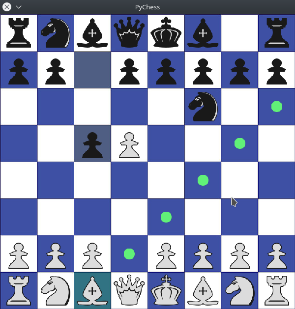
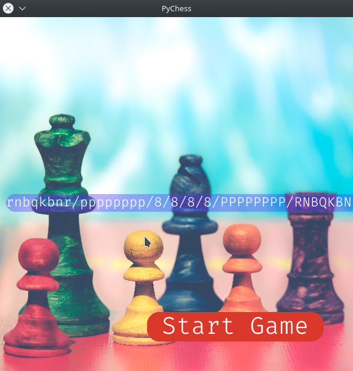

# Chess Game With Python
Chess game developed using python only.


- - - -

# Requirements 
pygame<br>
stockfish
- - - -

# How to run
First make sure you have all the required modules installed. Or simple run

```
pip3 install -r requirements.txt
```
After this run 
```
python3 gui.py 
```
and you should be good to go.
- - - -

# Features
- Play against the computer
- Setup board using Fen notation

- Play on your termninal


